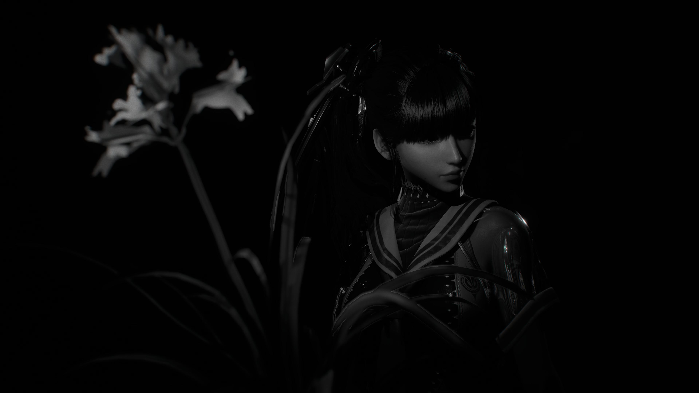
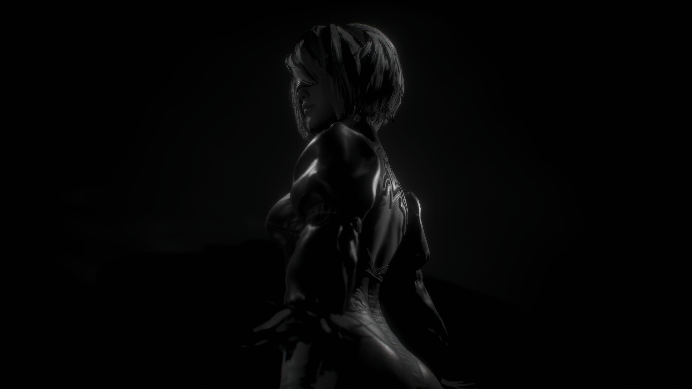
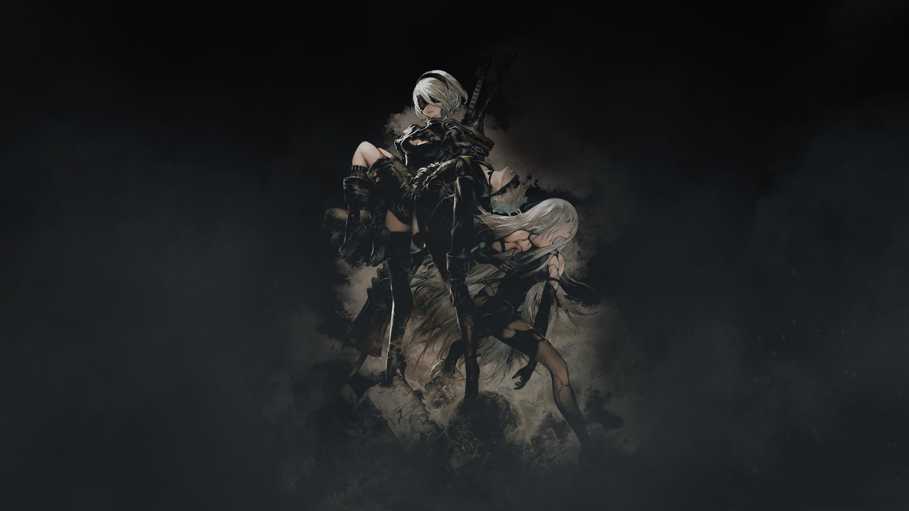
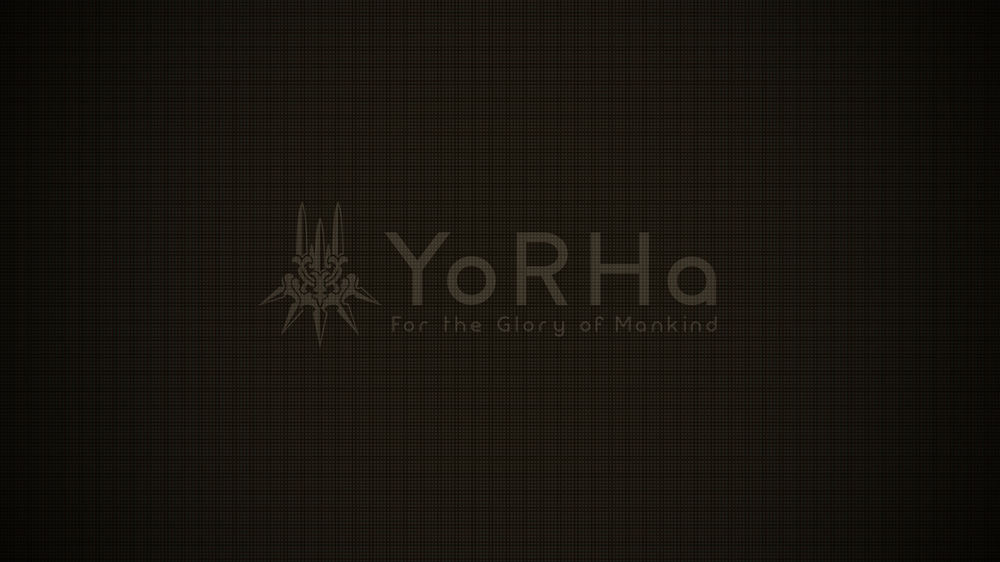
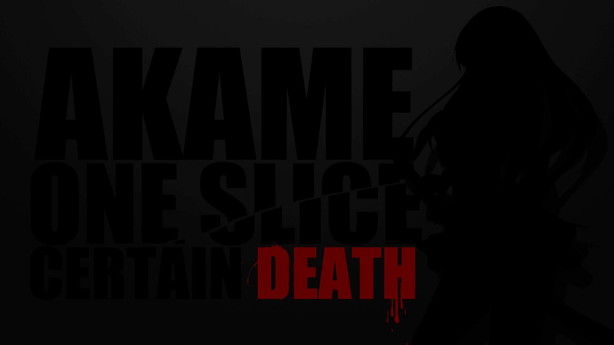

# Workstation configuration

Personal workstation configuration for all of
my machines (both NixOS and MacOS with nix-darwin).
This repository manages the operating system settings,
desktop, applications, development tools, and agent configuration, etc...

## Philosophy

- **Convenience comes first.** Keep workstation setup and changes in this
  repository and apply them through a system rebuild.

## Features

### Desktop

Both machines use scrolling, tiled windows and a shared Catppuccin palette
across supported applications.

- **Othinus (NixOS):** Niri, DankMaterialShell, Vicinae, and screenshot annotation.
  The display uses 60 Hz without VRR on battery and 165 Hz with VRR on AC power.
  Battery idle timers lock after 10 minutes and suspend after 15; AC disables both.
- **Proserpina (macOS):** OmniWM with nine workspaces, Raycast, and Nix-managed
  native apps. Option + arrows navigates windows; Option + 1–9 switches workspaces;
  Option + Enter opens a fresh Ghostty window. Homebrew is not required.
- **Web apps:** Dedicated Helium launchers on Linux and Chromium launchers in
  Raycast on macOS.

### Shell and development

Ghostty runs Nushell with Vi editing, Starship, and fuzzy navigation. In normal
mode, press Space followed by a key to open a picker:

| Keys        | Command       | Purpose                                        |
| ----------- | ------------- | ---------------------------------------------- |
| Space Space | `nav`         | Jump to a project, config folder, or SSH host. |
| Space n     | `git nav`     | Navigate branches, worktrees, and submodules.  |
| Space p     | `project-run` | Find and run a `package.json` script.          |

- **Project environments:** Devenv supplies project tools and language runtimes.
  Direnv loads them on entry, reloads configuration changes, and unloads on exit.
  T3 worktrees are trusted automatically; other checkouts require `direnv allow`.
- **Editor:** Shared LazyVim configuration, theme, language tooling, Git
  integration, and image previews. Project tools take precedence over Neovim's
  bundled helper runtimes.
- **Forge tools:** GitHub CLI (`gh`), Bitbucket CLI (`bkt`), and Forgejo CLI (`fj`).

### Coding agents

T3 Code, Codex, Claude Code, and OpenCode share instructions, skills, and themes.
Agent launchers enter the project's Devenv environment when needed.

- T3 Code keeps its nightly server and desktop on the same release.
- Codex and Claude Code follow stable publisher releases; OpenCode follows Numtide.
- Updates stage every three hours and activate at 04:00, independently of system
  rebuilds. Failed downloads or builds preserve the installed versions.
- Agent updates apply to new sessions. T3 Code activation restarts its server and
  reopens the desktop if it was running, which can interrupt active work.

### Remote access and snapshots

- **SSH:** `ssh othinus` and `ssh proserpina` connect to the two machines.
  A shared, passphrase-encrypted bundle provisions personal, work, and machine
  keys during rebuilds. Plaintext keys stay outside the repository and Nix store.
- **Private access:** Othinus exposes SSH and T3 Code over the LAN and Tailscale.
  Proserpina's T3 Code server listens only on localhost.
- **Snapshots:** Othinus snapshots home hourly and replicates it to the data disk;
  the data filesystem gets daily local snapshots.

### Wallpapers

On Othinus, DMS rotates the images in `~/Pictures/Wallpapers`. Its current local
setting changes wallpaper every five minutes; rotation is controlled in DMS,
not pinned by this repository. Wallpaper changes leave application themes intact.

Nix includes one image per original from [wallpapers/](wallpapers/), accepting
JPG, JPEG, PNG, and WebP. It prefers a `-2560x1440` variant matching the configured
display, otherwise the original. Variants never appear as separate rotation
entries. Akame uses the resized variant; the other six use their originals.

| Wallpaper                      | Preview                                                                                                         |
| ------------------------------ | --------------------------------------------------------------------------------------------------------------- |
| Stellar Blade: Eve, monochrome |  |
| Stellar Blade: 2B              |                           |
| NieR: Automata, dark           |                      |
| NieR: Automata, 2B, A2 and 9S  |         |
| NieR: Automata, YoRHa          |                    |
| Neverness to Everness: city    |       |
| Akame                          |                                        |

## Configuration and updates

The repository uses flake-parts and the dendritic pattern, without Home Manager.
[Modules](modules/) own features, [profiles](profiles/) select shared applications,
[hosts](hosts/) declare machine differences, and [themes](themes/) define the palette.
Linux and macOS have separate Nixpkgs pins.

| Command | Action                                            |
| ------- | ------------------------------------------------- |
| `ns`    | Rebuild and switch to the configured system.      |
| `nup`   | Refresh package sources and update rolling tools. |
| `nups`  | Update, then rebuild and switch.                  |

Pass a checkout path, such as `ns .`, to use a worktree. Without one, these commands
use the configured main checkout. Development checks live in [AGENTS.md](AGENTS.md).

## TODO

### Pending validation

- On Othinus, unplug the charger, wait five seconds, then reconnect it. Confirm
  the display stays usable, switches to 60 Hz with VRR off on battery, and
  returns to 165 Hz with VRR on when charging.

### Replace DankMaterialShell with our own Quickshell

Status: incomplete. Priority: low. Handle after the other TODO items.

Keep DMS until the custom shell covers every feature we want. Replace features
incrementally, then remove DMS in one deliberate change.

- [ ] Bar layout and per-monitor behavior
- [ ] Dynamic Niri workspace indicator and controls
- [ ] Clock, Slovak-style numeric dates, English month and weekday names
- [ ] Calendar and event integration
- [ ] System tray and status notifier items
- [ ] Wi-Fi status, network selection, and VPN controls
- [ ] Bluetooth status and device controls
- [ ] Output volume, microphone, mixer, and device selection
- [ ] Display brightness
- [ ] Battery state, charging state, and power profiles
- [ ] Notification daemon, popups, history, and notification center
- [ ] Clipboard history
- [ ] Vicinae launcher handoff and launcher state
- [ ] Lock screen and authentication flow
- [ ] Logout, suspend, reboot, and shutdown menu
- [ ] Audio, brightness, media, and power on-screen displays
- [ ] Idle timers, locking, display power, and suspend policy UI
- [ ] CPU, memory, disk, network, temperature, and process monitoring
- [ ] Media controls and player metadata
- [ ] Weather widgets
- [ ] Wallpaper and theme integration
- [ ] Central settings UI
- [ ] Screen recording and screen sharing indicators
- [ ] Keyboard layout and input state
- [ ] DND, night light, and other quick toggles
